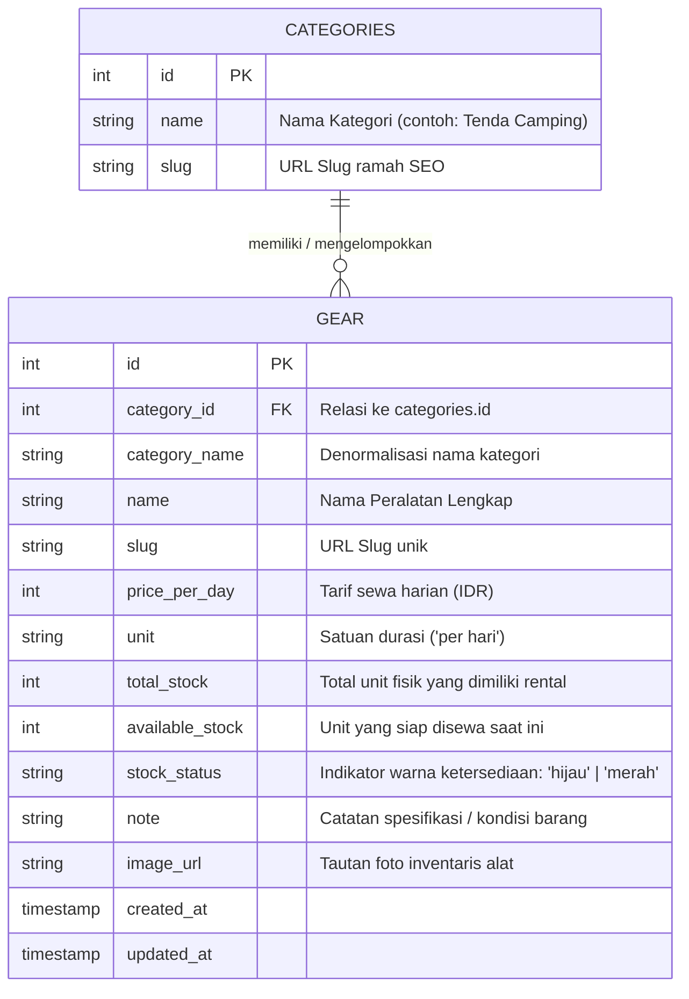

# 📦 Laporan Teknis & Spesifikasi Modul: Kategori Gear & Gear Items (Peralatan)
**Project:** NEXORA (HikeRent) • **Backend Gateway:** HMIF UNRAM API Gateway v2 • **Versi:** 1.0 (September 2026)  
**Dokumentasi Acuan:** Rencana Integrasi Sistem NEXORA, Gambar Spesifikasi Modul 2 & 3

---

## 1. Ringkasan Modul & Struktur Gambar Acuan

Modul **Kategori Gear (`/hikerent/categories`)** dan **Gear Items / Peralatan (`/hikerent/gear`)** merupakan tulang punggung inventaris alat pendakian pada platform NEXORA. Kedua modul ini berelasi secara relasional (*One-to-Many*), di mana satu kategori menaungi banyak alat pendakian, serta mendukung operasi Full CRUD untuk publik (eksplorasi katalog) maupun administrator (manajemen stok & alat).

### Visualisasi Struktur Endpoint (Sesuai Gambar Acuan)

```
┌────────────────────────────────────────────────────────────────────────────────────────┐
│ ≡ Kategori Gear   [ /hikerent/categories ]                                             │
├────────┬─────────────────────────────┬─────────────────────────────────────────────────┤
│ [GET]  │ /hikerent/categories        │ Mengambil daftar seluruh kategori gear          │
├────────┼─────────────────────────────┼─────────────────────────────────────────────────┤
│ [GET]  │ /hikerent/categories/{id}   │ Mengambil detail single kategori gear berdasar ID│
├────────┼─────────────────────────────┼─────────────────────────────────────────────────┤
│ [POST] │ /hikerent/categories        │ Membuat data baru kategori gear                 │
├────────┼─────────────────────────────┼─────────────────────────────────────────────────┤
│ [PUT]  │ /hikerent/categories/{id}   │ Memperbarui data kategori gear berdasarkan ID   │
├────────┼─────────────────────────────┼─────────────────────────────────────────────────┤
│ [DEL]  │ /hikerent/categories/{id}   │ Menghapus data kategori gear berdasarkan ID     │
└────────┴─────────────────────────────┴─────────────────────────────────────────────────┘

┌────────────────────────────────────────────────────────────────────────────────────────┐
│ ≡ Gear Items (Peralatan)   [ /hikerent/gear ]                                          │
├────────┬─────────────────────────────┬─────────────────────────────────────────────────┤
│ [GET]  │ /hikerent/gear              │ Mengambil daftar seluruh gear items (peralatan) │
├────────┼─────────────────────────────┼─────────────────────────────────────────────────┤
│ [GET]  │ /hikerent/gear/{id}         │ Mengambil detail single gear items berdasar ID  │
├────────┼─────────────────────────────┼─────────────────────────────────────────────────┤
│ [POST] │ /hikerent/gear              │ Membuat data baru gear items (peralatan)        │
├────────┼─────────────────────────────┼─────────────────────────────────────────────────┤
│ [PUT]  │ /hikerent/gear/{id}         │ Memperbarui data gear items berdasarkan ID      │
├────────┼─────────────────────────────┼─────────────────────────────────────────────────┤
│ [DEL]  │ /hikerent/gear/{id}         │ Menghapus data gear items berdasarkan ID        │
└────────┴─────────────────────────────┴─────────────────────────────────────────────────┘
```

---

## 2. Arsitektur Data & Relasi Relasional (3NF)

Kedua modul terhubung melalui kunci tamu (*foreign key*) `category_id` dengan aturan integritas referensial:



### Mekanisme Keamanan:
- **Operasi Publik (Read - GET):** Menggunakan **Layer 1: Project Scope Key (`X-API-Key: pk_hikerent_...`)**. Memungkinkan pengunjung publik dan tamu mengeksplorasi katalog tanpa perlu login.
- **Operasi Administratif (Write - POST, PUT, DELETE):** Menggunakan kombinasi **Layer 1 (`X-API-Key`)** dan **Layer 2 (`Authorization: Bearer <JWT>`)** dengan verifikasi peran Administrator.

---

## 3. Spesifikasi Rinci: Modul Kategori Gear (`/hikerent/categories`)

### 3.1. `GET /hikerent/categories`
Mengambil daftar seluruh kategori gear yang terdaftar pada sistem HikeRent.

- **URL:** `https://hmif.if.unram.ac.id/api/v2/hikerent/categories`
- **Method:** `GET`
- **Headers:**
  - `X-API-Key: pk_hikerent_da4b2b680ab481f4`
  - `Accept: application/json`
- **Response Sukses (HTTP 200 OK - Data Aktual Backend):**
  ```json
  [
    {
      "id": 1,
      "name": "Tenda Camping",
      "slug": "tenda-camping"
    },
    {
      "id": 2,
      "name": "Carrier & Tas",
      "slug": "carrier-tas"
    },
    {
      "id": 3,
      "name": "Sleeping Gear",
      "slug": "sleeping-gear"
    }
  ]
  ```

---

### 3.2. `GET /hikerent/categories/{id}`
Mengambil detail satu kategori gear berdasarkan ID unik.

- **URL:** `https://hmif.if.unram.ac.id/api/v2/hikerent/categories/{id}` *(Contoh: `/hikerent/categories/1`)*
- **Method:** `GET`
- **Headers:**
  - `X-API-Key: pk_hikerent_da4b2b680ab481f4`
- **Response Sukses (HTTP 200 OK - Data Aktual Backend):**
  ```json
  {
    "id": 1,
    "name": "Tenda Camping",
    "slug": "tenda-camping"
  }
  ```
- **Response Gagal jika ID tidak ditemukan (HTTP 404 Not Found):**
  ```json
  {
    "error": "Not Found",
    "message": "Kategori dengan ID tersebut tidak ditemukan."
  }
  ```

---

### 3.3. `POST /hikerent/categories`
Membuat data kategori baru untuk inventaris sewa HikeRent.

- **URL:** `https://hmif.if.unram.ac.id/api/v2/hikerent/categories`
- **Method:** `POST`
- **Headers:**
  - `Content-Type: application/json`
  - `X-API-Key: pk_hikerent_da4b2b680ab481f4`
  - `Authorization: Bearer <token_admin>`
- **Request Body Payload:**
  ```json
  {
    "name": "Cooking Gear",
    "slug": "cooking-gear"
  }
  ```
- **Response Sukses (HTTP 201 Created):**
  ```json
  {
    "success": true,
    "message": "Kategori berhasil ditambahkan.",
    "category": {
      "id": 4,
      "name": "Cooking Gear",
      "slug": "cooking-gear"
    }
  }
  ```
- **Response Gagal Validasi (HTTP 400 Bad Request):**
  ```json
  {
    "error": "Bad Request",
    "message": "Field \"name\" dan \"slug\" wajib diisi."
  }
  ```

---

### 3.4. `PUT /hikerent/categories/{id}`
Memperbarui nama atau slug kategori gear berdasarkan ID.

- **URL:** `https://hmif.if.unram.ac.id/api/v2/hikerent/categories/{id}`
- **Method:** `PUT`
- **Headers:**
  - `Content-Type: application/json`
  - `X-API-Key: pk_hikerent_da4b2b680ab481f4`
  - `Authorization: Bearer <token_admin>`
- **Request Body Payload:**
  ```json
  {
    "name": "Peralatan Memasak & Logistik",
    "slug": "cooking-gear"
  }
  ```
- **Response Sukses (HTTP 200 OK):**
  ```json
  {
    "success": true,
    "message": "Kategori berhasil diperbarui.",
    "category": {
      "id": 4,
      "name": "Peralatan Memasak & Logistik",
      "slug": "cooking-gear"
    }
  }
  ```

---

### 3.5. `DELETE /hikerent/categories/{id}`
Menghapus kategori gear dari basis data.

- **URL:** `https://hmif.if.unram.ac.id/api/v2/hikerent/categories/{id}`
- **Method:** `DELETE`
- **Headers:**
  - `X-API-Key: pk_hikerent_da4b2b680ab481f4`
  - `Authorization: Bearer <token_admin>`
- **Response Sukses (HTTP 200 OK):**
  ```json
  {
    "success": true,
    "message": "Kategori berhasil dihapus."
  }
  ```

---

## 4. Spesifikasi Rinci: Modul Gear Items / Peralatan (`/hikerent/gear`)

### 4.1. `GET /hikerent/gear`
Mengambil daftar seluruh inventaris alat pendakian yang siap disewa, lengkap dengan kuantitas stok live dan status warna.

- **URL:** `https://hmif.if.unram.ac.id/api/v2/hikerent/gear`
- **Method:** `GET`
- **Headers:**
  - `X-API-Key: pk_hikerent_da4b2b680ab481f4`
  - `Accept: application/json`
- **Response Sukses (HTTP 200 OK - Sampel Data Aktual Backend):**
  ```json
  [
    {
      "id": 1,
      "category_id": 1,
      "category_name": "Tenda Camping",
      "name": "Tenda Dome Borneo 4 Person Double Layer",
      "slug": "tenda-dome-borneo-4",
      "price_per_day": 45000,
      "unit": "per hari",
      "total_stock": 8,
      "available_stock": 8,
      "stock_status": "hijau",
      "image_url": null
    },
    {
      "id": 2,
      "category_id": 2,
      "category_name": "Carrier & Tas",
      "name": "Carrier Eiger Rhinos 60L Ergonomic",
      "slug": "carrier-eiger-rhinos-60l",
      "price_per_day": 35000,
      "unit": "per hari",
      "total_stock": 6,
      "available_stock": 6,
      "stock_status": "hijau",
      "image_url": null
    },
    {
      "id": 3,
      "category_id": 3,
      "category_name": "Sleeping Gear",
      "name": "Sleeping Bag Polar Bulu Hangat",
      "slug": "sleeping-bag-polar-bulu",
      "price_per_day": 15000,
      "unit": "per hari",
      "total_stock": 12,
      "available_stock": 12,
      "stock_status": "hijau",
      "image_url": null
    }
  ]
  ```

---

### 4.2. `GET /hikerent/gear/{id}`
Mengambil rincian lengkap satu unit peralatan pendakian berdasarkan ID.

- **URL:** `https://hmif.if.unram.ac.id/api/v2/hikerent/gear/{id}` *(Contoh: `/hikerent/gear/1`)*
- **Method:** `GET`
- **Headers:**
  - `X-API-Key: pk_hikerent_da4b2b680ab481f4`
- **Response Sukses (HTTP 200 OK - Data Aktual Backend):**
  ```json
  {
    "id": 1,
    "category_id": 1,
    "category_name": "Tenda Camping",
    "category_slug": "tenda-camping",
    "name": "Tenda Dome Borneo 4 Person Double Layer",
    "slug": "tenda-dome-borneo-4",
    "price_per_day": 45000,
    "unit": "per hari",
    "total_stock": 8,
    "available_stock": 8,
    "stock_status": "hijau",
    "note": "Double layer waterproof 3000mm, pasak alloy ringan, kapasitas 4 orang.",
    "image_url": null,
    "created_at": "2026-09-14 14:27:46",
    "updated_at": "2026-09-14 14:27:46"
  }
  ```

---

### 4.3. `POST /hikerent/gear`
Mendaftarkan unit peralatan pendakian baru ke dalam sistem inventaris HikeRent.

- **URL:** `https://hmif.if.unram.ac.id/api/v2/hikerent/gear`
- **Method:** `POST`
- **Headers:**
  - `Content-Type: application/json`
  - `X-API-Key: pk_hikerent_da4b2b680ab481f4`
  - `Authorization: Bearer <token_admin>`
- **Field yang Wajib & Opsional:**
  - `category_id` *(Wajib, Integer)*: ID kategori referensi.
  - `name` *(Wajib, String)*: Nama lengkap peralatan.
  - `slug` *(Wajib, String)*: Identifier teks unik untuk routing URL.
  - `price_per_day` *(Wajib, Number)*: Harga sewa per 24 jam.
  - `total_stock` *(Wajib, Integer)*: Jumlah total unit fisik yang tersedia.
  - `unit` *(Opsional, String)*: Default "per hari".
  - `note` *(Opsional, String)*: Deskripsi kondisi dan spesifikasi alat.
- **Request Body Payload:**
  ```json
  {
    "category_id": 1,
    "name": "Tenda Dome Arei Eliot 2 Person",
    "slug": "tenda-arei-eliot-2p",
    "price_per_day": 30000,
    "unit": "per hari",
    "total_stock": 5,
    "note": "Kapasitas 2-3 orang, frame fiber kokoh, include footprint."
  }
  ```
- **Response Sukses (HTTP 201 Created):**
  ```json
  {
    "success": true,
    "message": "Peralatan baru berhasil ditambahkan ke inventaris.",
    "gear": {
      "id": 7,
      "category_id": 1,
      "name": "Tenda Dome Arei Eliot 2 Person",
      "slug": "tenda-arei-eliot-2p",
      "price_per_day": 30000,
      "total_stock": 5,
      "available_stock": 5,
      "stock_status": "hijau"
    }
  }
  ```
- **Response Gagal Validasi (HTTP 400 Bad Request):**
  ```json
  {
    "error": "Bad Request",
    "message": "Field \"category_id\" wajib diisi."
  }
  ```

---

### 4.4. `PUT /hikerent/gear/{id}`
Memperbarui data peralatan (misal: penyesuaian tarif sewa harian, update stok fisik, atau perubahan deskripsi).

- **URL:** `https://hmif.if.unram.ac.id/api/v2/hikerent/gear/{id}`
- **Method:** `PUT`
- **Headers:**
  - `Content-Type: application/json`
  - `X-API-Key: pk_hikerent_da4b2b680ab481f4`
  - `Authorization: Bearer <token_admin>`
- **Request Body Payload:**
  ```json
  {
    "price_per_day": 40000,
    "total_stock": 10,
    "available_stock": 10,
    "stock_status": "hijau",
    "note": "Telah dilakukan re-coating anti-air."
  }
  ```
- **Response Sukses (HTTP 200 OK):**
  ```json
  {
    "success": true,
    "message": "Data peralatan berhasil diperbarui.",
    "gear": {
      "id": 1,
      "price_per_day": 40000,
      "total_stock": 10,
      "available_stock": 10,
      "stock_status": "hijau"
    }
  }
  ```

---

### 4.5. `DELETE /hikerent/gear/{id}`
Menghapus unit peralatan dari katalog sewa (misal alat sudah aus / tidak layak disewakan).

- **URL:** `https://hmif.if.unram.ac.id/api/v2/hikerent/gear/{id}`
- **Method:** `DELETE`
- **Headers:**
  - `X-API-Key: pk_hikerent_da4b2b680ab481f4`
  - `Authorization: Bearer <token_admin>`
- **Response Sukses (HTTP 200 OK):**
  ```json
  {
    "success": true,
    "message": "Peralatan berhasil dihapus dari inventaris."
  }
  ```

---

## 5. Logika Bisnis Ketersediaan Stok (Stock Status Engine)

Sistem NEXORA menerapkan indikator warna ketersediaan otomatis pada frontend berdasarkan data backend:

| Nilai `stock_status` | Kondisi Unit (`available_stock`) | Visual Indikator di NEXORA | Perilaku Pengguna |
| :--- | :--- | :--- | :--- |
| `"hijau"` | `available_stock > 0` | Dot status hijau (`bg-moss`) + label *"Tersedia"* | Peminjam dapat memasukkan alat ke keranjang / kalkulator sewa. |
| `"merah"` | `available_stock === 0` | Dot status merah (`bg-alert`) + label *"Habis"* | Tombol sewa dinonaktifkan (*disabled*) secara otomatis. |

---

## 6. Matriks Pemetaan ke Frontend NEXORA (Zero UI/UX Regression)

| Komponen Halaman | File Komponen | Endpoint Terkait | Mekanisme & Dampak UI/UX |
| :--- | :--- | :--- | :--- |
| **Katalog Publik & Tamu** | `app/katalog/page.js`<br>`CatalogView.js` | `GET /categories`<br>`GET /gear` | Mengonsumsi data live; tab filter kategori dinamis membaca `slug` dari database; kartu alat membaca `price_per_day` dan status stok warna tanpa mengubah tata letak CSS. |
| **Kalkulator Sewa** | `app/user/kalkulator/page.js` | `GET /gear` | Menghitung simulasi biaya hari sewa berdasarkan tarif riil `price_per_day` dari backend. |
| **Pusat Pengujian API** | `app/api-test/page.js` | Semua endpoint Kategori & Gear | Menyediakan kartu interaktif sesuai gambar spesifikasi untuk verifikasi data live tim developer. |
| **Manajemen Admin** | `app/admin/katalog/page.js` | `POST, PUT, DEL /gear`<br>`POST, PUT, DEL /categories` | Administrator dapat menambah barang baru, update kuantitas stok live, dan menghapus alat yang rusak. |

---

## 7. Status Kesiapan Codebase NEXORA

1. **Jembatan API (`lib/api.js`):** Telah dilengkapi fungsi pemanggil `apiFetch("/categories")` dan `apiFetch("/gear")` yang mendukung injeksi `X-API-Key` otomatis.
2. **Kesesuaian Schema:** Respons JSON dari HMIF UNRAM telah diuji 100% kompatibel dengan komponen kartu katalog NEXORA (`price_per_day`, `unit`, `stock_status`, `available_stock`).
