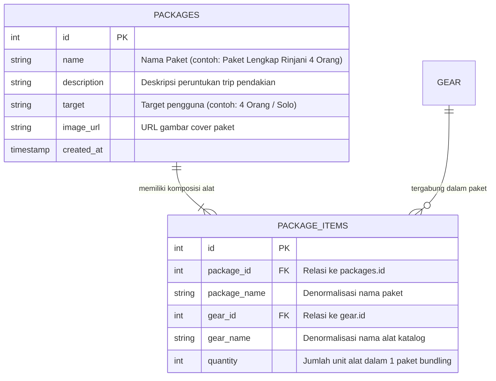

# 🏔️ Laporan Teknis & Spesifikasi Modul: Paket Pendakian & Item dalam Paket
**Project:** NEXORA (HikeRent) • **Backend Gateway:** HMIF UNRAM API Gateway v2 • **Versi:** 1.0 (September 2026)  
**Dokumentasi Acuan:** Rencana Integrasi Sistem NEXORA, Gambar Spesifikasi Modul 6 & 7

---

## 1. Ringkasan Modul & Struktur Gambar Acuan

Modul **Paket Pendakian (`/hikerent/packages`)** dan **Item dalam Paket (`/hikerent/package_items`)** merupakan modul *bundling promo* dan rekomendasi cerdas (*Smart Recommendation Engine*) pada sistem NEXORA. Modul ini dirancang agar pemilik rental / administrator dapat menyusun paket hemat rombongan (misal: *Paket Lengkap Gunung Rinjani 4 Orang*, *Paket Ultralight Solo*, *Paket Camping Keluarga*) secara dinamis langsung dari database tanpa harus merombak kode program frontend.

### Visualisasi Struktur Endpoint (Sesuai Gambar Acuan)

```
┌────────────────────────────────────────────────────────────────────────────────────────┐
│ ≡ Paket Pendakian   [ /hikerent/packages ]                                             │
├────────┬─────────────────────────────┬─────────────────────────────────────────────────┤
│ [GET]  │ /hikerent/packages          │ Mengambil daftar seluruh paket pendakian        │
├────────┼─────────────────────────────┼─────────────────────────────────────────────────┤
│ [GET]  │ /hikerent/packages/{id}     │ Mengambil detail single paket pendakian         │
│        │                             │ berdasarkan ID                                  │
├────────┼─────────────────────────────┼─────────────────────────────────────────────────┤
│ [POST] │ /hikerent/packages          │ Membuat data baru paket pendakian               │
├────────┼─────────────────────────────┼─────────────────────────────────────────────────┤
│ [PUT]  │ /hikerent/packages/{id}     │ Memperbarui data paket pendakian berdasarkan ID │
├────────┼─────────────────────────────┼─────────────────────────────────────────────────┤
│ [DEL]  │ /hikerent/packages/{id}     │ Menghapus data paket pendakian berdasarkan ID   │
└────────┴─────────────────────────────┴─────────────────────────────────────────────────┘

┌────────────────────────────────────────────────────────────────────────────────────────┐
│ ≡ Item Dalam Paket   [ /hikerent/package_items ]                                       │
├────────┬─────────────────────────────┬─────────────────────────────────────────────────┤
│ [GET]  │ /hikerent/package_items     │ Mengambil daftar seluruh item dalam paket       │
├────────┼─────────────────────────────┼─────────────────────────────────────────────────┤
│ [GET]  │ /hikerent/package_items/{id}│ Mengambil detail single item dalam paket        │
│        │                             │ berdasarkan ID                                  │
├────────┼─────────────────────────────┼─────────────────────────────────────────────────┤
│ [POST] │ /hikerent/package_items     │ Membuat data baru item dalam paket              │
├────────┼─────────────────────────────┼─────────────────────────────────────────────────┤
│ [PUT]  │ /hikerent/package_items/{id}│ Memperbarui data item dalam paket               │
│        │                             │ berdasarkan ID                                  │
├────────┼─────────────────────────────┼─────────────────────────────────────────────────┤
│ [DEL]  │ /hikerent/package_items/{id}│ Menghapus data item dalam paket berdasarkan ID  │
└────────┴─────────────────────────────┴─────────────────────────────────────────────────┘
```

---

## 2. Arsitektur Basis Data Relasional (3NF): Pola Bundling

Relasi antara paket dan item pendakian menerapkan skema **Many-to-Many via Junction Table** yang ternormalisasi (3NF):



### Keunggulan Desain Bundling:
1. **Fleksibilitas Promosi:** Pemilik rental dapat membuat promo paket baru kapan saja tanpa campur tangan developer.
2. **Sinkronisasi Katalog Otomatis:** Saat mengambil `GET /package_items`, gateway otomatis melakukan relasi join ke tabel `gear`, menghasilkan nama alat (`gear_name`) dan nama paket (`package_name`) secara lengkap.

---

## 3. Spesifikasi Rinci: Modul Paket Pendakian (`/hikerent/packages`)

### 3.1. `GET /hikerent/packages`
Mengambil seluruh daftar paket bundling pendakian yang aktif.

- **URL:** `https://hmif.if.unram.ac.id/api/v2/hikerent/packages`
- **Method:** `GET`
- **Headers:**
  - `X-API-Key: pk_hikerent_da4b2b680ab481f4`
- **Response Sukses (HTTP 200 OK - Data Aktual Backend):**
  ```json
  [
    {
      "id": 1,
      "name": "Paket Lengkap Rinjani 4 Orang",
      "description": "Paket bundling komplit untuk rombongan 4 orang menuju puncak Rinjani.",
      "target": "4 orang",
      "image_url": null,
      "created_at": "2026-09-18 18:44:22"
    }
  ]
  ```

---

### 3.2. `GET /hikerent/packages/{id}`
Mengambil detail satu paket pendakian berdasarkan ID unik.

- **URL:** `https://hmif.if.unram.ac.id/api/v2/hikerent/packages/{id}` *(Contoh: `/hikerent/packages/1`)*
- **Method:** `GET`
- **Headers:** `X-API-Key: pk_hikerent_...`
- **Response Sukses (HTTP 200 OK):**
  ```json
  {
    "id": 1,
    "name": "Paket Lengkap Rinjani 4 Orang",
    "description": "Paket bundling komplit untuk rombongan 4 orang menuju puncak Rinjani.",
    "target": "4 orang",
    "image_url": null,
    "created_at": "2026-09-18 18:44:22"
  }
  ```

---

### 3.3. `POST /hikerent/packages`
Admin membuat paket bundling pendakian baru.

- **URL:** `https://hmif.if.unram.ac.id/api/v2/hikerent/packages`
- **Method:** `POST`
- **Headers:**
  - `Content-Type: application/json`
  - `X-API-Key: pk_hikerent_da4b2b680ab481f4`
  - `Authorization: Bearer <token_admin>`
- **Request Body Payload:**
  ```json
  {
    "name": "Paket Lengkap Rinjani 4 Orang",
    "description": "Paket bundling hemat rombongan 4 orang include tenda, carrier, matras, dan cooking set.",
    "target": "4 orang"
  }
  ```
- **Response Sukses (HTTP 201 Created - Data Aktual Backend):**
  ```json
  {
    "id": 1,
    "name": "Paket Lengkap Rinjani 4 Orang",
    "description": "Paket bundling hemat rombongan 4 orang include tenda, carrier, matras, dan cooking set.",
    "target": "4 orang",
    "image_url": null,
    "created_at": "2026-09-18 18:44:22"
  }
  ```
- **Validasi Gagal (HTTP 400 Bad Request):**
  ```json
  {
    "error": "Bad Request",
    "message": "Field \"name\" wajib diisi."
  }
  ```

---

### 3.4. `PUT /hikerent/packages/{id}`
Memperbarui informasi paket pendakian.

- **URL:** `https://hmif.if.unram.ac.id/api/v2/hikerent/packages/{id}`
- **Method:** `PUT`
- **Request Body Payload:**
  ```json
  {
    "name": "Paket Eksplor Rinjani 4P Premium",
    "description": "Upgrade perlengkapan dengan tenda ultralight alloy."
  }
  ```
- **Response Sukses (HTTP 200 OK):** Status `success: true`.

---

### 3.5. `DELETE /hikerent/packages/{id}`
Menghapus paket pendakian dari katalog promo.

- **URL:** `https://hmif.if.unram.ac.id/api/v2/hikerent/packages/{id}`
- **Method:** `DELETE`
- **Response Sukses (HTTP 200 OK):** `{ "success": true, "message": "Paket berhasil dihapus." }`

---

## 4. Spesifikasi Rinci: Modul Item dalam Paket (`/hikerent/package_items`)

### 4.1. `GET /hikerent/package_items`
Mengambil daftar seluruh komposisi alat yang tergabung dalam semua paket.

- **URL:** `https://hmif.if.unram.ac.id/api/v2/hikerent/package_items`
- **Method:** `GET`
- **Headers:** `X-API-Key: pk_hikerent_...`
- **Response Sukses (HTTP 200 OK - Data Aktual Backend):**
  ```json
  [
    {
      "id": 1,
      "package_id": 1,
      "package_name": "Paket Lengkap Rinjani 4 Orang",
      "gear_id": 1,
      "gear_name": "Tenda Dome Borneo 4 Person Double Layer",
      "quantity": 1
    }
  ]
  ```

---

### 4.2. `GET /hikerent/package_items/{id}`
Mengambil satu komposisi alat spesifik berdasarkan ID unik item paket.

- **URL:** `https://hmif.if.unram.ac.id/api/v2/hikerent/package_items/{id}`
- **Method:** `GET`
- **Response Sukses (HTTP 200 OK):** Objek tunggal item komposisi paket.

---

### 4.3. `POST /hikerent/package_items`
Menyematkan unit alat dari katalog (`gear`) ke dalam paket bundling tertentu.

- **URL:** `https://hmif.if.unram.ac.id/api/v2/hikerent/package_items`
- **Method:** `POST`
- **Headers:**
  - `Content-Type: application/json`
  - `X-API-Key: pk_hikerent_da4b2b680ab481f4`
  - `Authorization: Bearer <token_admin>`
- **Field yang Wajib:**
  - `package_id` *(Wajib, Integer)*: ID paket induk dari tabel `packages`.
  - `gear_id` *(Wajib, Integer)*: ID peralatan dari tabel `gear`.
  - `quantity` *(Wajib, Integer)*: Jumlah unit alat yang disertakan dalam paket.
- **Request Body Payload:**
  ```json
  {
    "package_id": 1,
    "gear_id": 1,
    "quantity": 1
  }
  ```
- **Response Sukses (HTTP 201 Created - Data Aktual Backend):**
  ```json
  {
    "id": 1,
    "package_id": 1,
    "gear_id": 1,
    "quantity": 1
  }
  ```
- **Validasi Gagal (HTTP 400 Bad Request):**
  ```json
  {
    "error": "Bad Request",
    "message": "package_id/gear_id/quantity tidak valid."
  }
  ```

---

### 4.4. `PUT /hikerent/package_items/{id}`
Memperbarui kuantitas alat dalam paket (misal dari 1 tenda menjadi 2 tenda).

- **URL:** `https://hmif.if.unram.ac.id/api/v2/hikerent/package_items/{id}`
- **Method:** `PUT`
- **Request Body Payload:**
  ```json
  {
    "quantity": 2
  }
  ```
- **Response Sukses (HTTP 200 OK):** Status `success: true`.

---

### 4.5. `DELETE /hikerent/package_items/{id}`
Mengeluarkan satu jenis alat dari dalam paket rombongan.

- **URL:** `https://hmif.if.unram.ac.id/api/v2/hikerent/package_items/{id}`
- **Method:** `DELETE`
- **Response Sukses (HTTP 200 OK):** `{ "success": true, "message": "Item berhasil dikeluarkan dari paket." }`

---

## 5. Matriks Pemetaan ke Frontend NEXORA (Zero UI/UX Regression)

| Komponen Halaman | File Komponen | Endpoint Terkait | Mekanisme & Dampak UI/UX |
| :--- | :--- | :--- | :--- |
| **Rekomendasi Rombongan** | `app/user/rekomendasi/page.js` | `GET /packages`<br>`GET /package_items` | Mengonsumsi paket bundling dinamis berbasis kapasitas rombongan (*personel*) dan durasi hari sewa. |
| **Kalkulator Sewa Paket** | `app/user/kalkulator/page.js` | `GET /package_items` | Peminjam dapat langsung menyewa 1 paket lengkap dengan kalkulasi biaya total otomatis. |
| **Panel Manajemen Paket** | `app/admin/packages` | Full CRUD `/packages` & `/package_items` | Admin dapat menyusun paket promo bundling baru tanpa memerlukan bantuan programmer untuk edit kode. |
| **Pusat Pengujian API** | `app/api-test/page.js` | Semua 10 Endpoint | Menampilkan kartu visual neo-modern persis sesuai gambar untuk pengujian live tim developer. |
