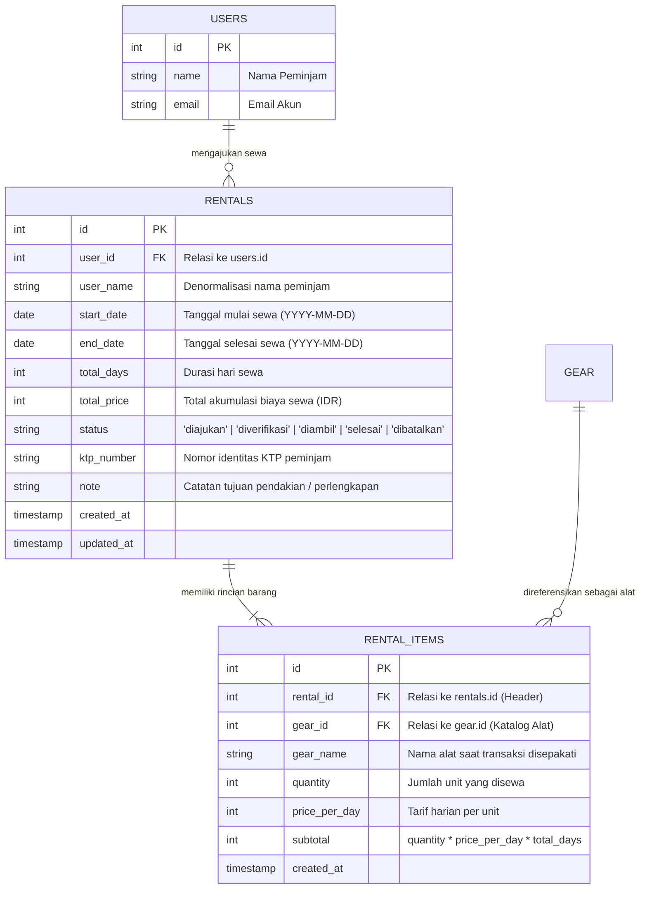

# 📑 Laporan Teknis & Spesifikasi Modul: Transaksi Rental & Detail Rental Items
**Project:** NEXORA (HikeRent) • **Backend Gateway:** HMIF UNRAM API Gateway v2 • **Versi:** 1.0 (September 2026)  
**Dokumentasi Acuan:** Rencana Integrasi Sistem NEXORA, Gambar Spesifikasi Modul 4 & 5

---

## 1. Ringkasan Modul & Struktur Gambar Acuan

Modul **Transaksi Rental HikeRent (`/hikerent/rentals`)** dan **Detail Rental Items (`/hikerent/rental_items`)** merupakan inti proses bisnis peminjaman alat pendakian pada platform NEXORA. Kedua modul ini merealisasikan prinsip normalisasi basis data relasional **Third Normal Form (3NF)** melalui pemisahan data antara faktur transaksi induk (*Header*) dan rincian item barang yang disewa (*Detail*).

### Visualisasi Struktur Endpoint (Sesuai Gambar Acuan)

```
┌────────────────────────────────────────────────────────────────────────────────────────┐
│ ≡ Transaksi Rental HikeRent   [ /hikerent/rentals ]                                    │
├────────┬─────────────────────────────┬─────────────────────────────────────────────────┤
│ [GET]  │ /hikerent/rentals           │ Mengambil daftar seluruh transaksi rental       │
│        │                             │ hikerent                                        │
├────────┼─────────────────────────────┼─────────────────────────────────────────────────┤
│ [GET]  │ /hikerent/rentals/{id}      │ Mengambil detail single transaksi rental        │
│        │                             │ hikerent berdasarkan ID                         │
├────────┼─────────────────────────────┼─────────────────────────────────────────────────┤
│ [POST] │ /hikerent/rentals           │ Membuat data baru transaksi rental hikerent     │
├────────┼─────────────────────────────┼─────────────────────────────────────────────────┤
│ [PUT]  │ /hikerent/rentals/{id}      │ Memperbarui data transaksi rental hikerent      │
│        │                             │ berdasarkan ID                                  │
├────────┼─────────────────────────────┼─────────────────────────────────────────────────┤
│ [DEL]  │ /hikerent/rentals/{id}      │ Menghapus data transaksi rental hikerent        │
│        │                             │ berdasarkan ID                                  │
└────────┴─────────────────────────────┴─────────────────────────────────────────────────┘

┌────────────────────────────────────────────────────────────────────────────────────────┐
│ ≡ Detail Rental Items   [ /hikerent/rental_items ]                                     │
├────────┬─────────────────────────────┬─────────────────────────────────────────────────┤
│ [GET]  │ /hikerent/rental_items      │ Mengambil daftar seluruh detail rental items    │
├────────┼─────────────────────────────┼─────────────────────────────────────────────────┤
│ [GET]  │ /hikerent/rental_items/{id} │ Mengambil detail single detail rental items     │
│        │                             │ berdasarkan ID                                  │
├────────┼─────────────────────────────┼─────────────────────────────────────────────────┤
│ [POST] │ /hikerent/rental_items      │ Membuat data baru detail rental items           │
├────────┼─────────────────────────────┼─────────────────────────────────────────────────┤
│ [PUT]  │ /hikerent/rental_items/{id} │ Memperbarui data detail rental items            │
│        │                             │ berdasarkan ID                                  │
├────────┼─────────────────────────────┼─────────────────────────────────────────────────┤
│ [DEL]  │ /hikerent/rental_items/{id} │ Menghapus data detail rental items berdasarkan  │
│        │                             │ ID                                              │
└────────┴─────────────────────────────┴─────────────────────────────────────────────────┘
```

---

## 2. Arsitektur Basis Data Relasional (3NF) & Pola Header-Detail

Pemisahan antara tabel transaksi induk (`rentals`) dan rincian barang (`rental_items`) merupakan standar industri dalam perancangan sistem e-commerce dan sewa multi-item:



### Keunggulan Desain Header-Detail:
1. **Multi-Item Tanpa Duplikasi Peminjam:** Pengguna dapat menyewa 1 Tenda, 2 Matras, dan 1 Kompor dalam 1 kali transaksi tanpa menduplikasi data identitas diri peminjam.
2. **Histori Harga Terkunci (*Price Snapshot*):** Kolom `price_per_day` pada `rental_items` mengabadikan harga saat transaksi terjadi, sehingga jika admin mengubah harga sewa di katalog di masa mendatang, nilai historis transaksi lama tidak berubah.

---

## 3. Spesifikasi Rinci: Modul Transaksi Rental (`/hikerent/rentals`)

### 3.1. `GET /hikerent/rentals`
Mengambil seluruh daftar transaksi sewa (untuk panel admin atau filter peminjam aktif).

- **URL:** `https://hmif.if.unram.ac.id/api/v2/hikerent/rentals`
- **Method:** `GET`
- **Headers:**
  - `X-API-Key: pk_hikerent_da4b2b680ab481f4`
  - `Authorization: Bearer <token>`
- **Response Sukses (HTTP 200 OK - Data Aktual Gateway):**
  ```json
  [
    {
      "id": 1,
      "user_id": 12,
      "user_name": "Rian Pratama",
      "start_date": "2026-09-20",
      "end_date": "2026-09-23",
      "total_days": 3,
      "total_price": 135000,
      "status": "diajukan",
      "ktp_number": "5201012304950001",
      "note": "Trip pendakian Gunung Rinjani jalur Senaru.",
      "created_at": "2026-09-18 10:15:00"
    }
  ]
  ```

---

### 3.2. `GET /hikerent/rentals/{id}`
Mengambil detail satu faktur transaksi sewa berdasarkan ID.

- **URL:** `https://hmif.if.unram.ac.id/api/v2/hikerent/rentals/{id}` *(Contoh: `/hikerent/rentals/1`)*
- **Method:** `GET`
- **Headers:**
  - `X-API-Key: pk_hikerent_da4b2b680ab481f4`
  - `Authorization: Bearer <token>`
- **Response Sukses (HTTP 200 OK):** Mengembalikan objek tunggal transaksi sewa.

---

### 3.3. `POST /hikerent/rentals`
Membuat faktur transaksi sewa baru saat peminjam menyelesaikan formulir *checkout*.

- **URL:** `https://hmif.if.unram.ac.id/api/v2/hikerent/rentals`
- **Method:** `POST`
- **Headers:**
  - `Content-Type: application/json`
  - `X-API-Key: pk_hikerent_da4b2b680ab481f4`
  - `Authorization: Bearer <token>`
- **Field yang Wajib & Format:**
  - `user_id` *(Wajib, Integer)*: ID peminjam yang sedang login.
  - `start_date` *(Wajib, String YYYY-MM-DD)*: Tanggal awal pengambilan alat.
  - `end_date` *(Wajib, String YYYY-MM-DD)*: Tanggal pengembalian alat.
  - `total_price` *(Wajib, Integer)*: Akumulasi biaya sewa yang telah dihitung browser.
  - `ktp_number` *(Opsional/Direkomendasikan, String)*: Nomor identitas KTP.
  - `note` *(Opsional, String)*: Catatan peminjaman.
- **Request Body Payload:**
  ```json
  {
    "user_id": 12,
    "start_date": "2026-09-20",
    "end_date": "2026-09-23",
    "total_days": 3,
    "total_price": 135000,
    "ktp_number": "5201012304950001",
    "note": "Rombongan 4 orang menuju Plawangan Sembalun"
  }
  ```
- **Response Sukses (HTTP 201 Created):**
  ```json
  {
    "success": true,
    "message": "Pengajuan sewa berhasil dibuat.",
    "rental": {
      "id": 1,
      "user_id": 12,
      "status": "diajukan",
      "total_price": 135000
    }
  }
  ```

---

### 3.4. `PUT /hikerent/rentals/{id}`
Memperbarui data transaksi sewa (misal: perubahan status persetujuan oleh admin).

- **URL:** `https://hmif.if.unram.ac.id/api/v2/hikerent/rentals/{id}`
- **Method:** `PUT`
- **Request Body Payload (Update Status Approval Admin):**
  ```json
  {
    "status": "diverifikasi"
  }
  ```
- **Response Sukses (HTTP 200 OK):** Status `success: true`.

---

### 3.5. `DELETE /hikerent/rentals/{id}`
Menghapus / membatalkan transaksi sewa oleh admin atau peminjam sebelum diproses.

- **URL:** `https://hmif.if.unram.ac.id/api/v2/hikerent/rentals/{id}`
- **Method:** `DELETE`
- **Response Sukses (HTTP 200 OK):**
  ```json
  {
    "success": true,
    "message": "Data transaksi sewa berhasil dihapus."
  }
  ```

---

## 4. Spesifikasi Rinci: Modul Detail Rental Items (`/hikerent/rental_items`)

### 4.1. `GET /hikerent/rental_items`
Mengambil seluruh data rincian barang dari semua transaksi sewa.

- **URL:** `https://hmif.if.unram.ac.id/api/v2/hikerent/rental_items`
- **Method:** `GET`
- **Headers:** `X-API-Key: pk_hikerent_...` + `Authorization: Bearer <token>`
- **Response Sukses (HTTP 200 OK):** Mengembalikan array daftar rincian barang.

---

### 4.2. `GET /hikerent/rental_items/{id}`
Mengambil detail spesifik satu baris rincian barang berdasarkan ID unik item.

- **URL:** `https://hmif.if.unram.ac.id/api/v2/hikerent/rental_items/{id}`
- **Method:** `GET`
- **Response Sukses (HTTP 200 OK):** Data unit alat yang disewa.

---

### 4.3. `POST /hikerent/rental_items`
Mencatat alat yang disewa ke dalam faktur transaksi rental induk yang bersangkutan.

- **URL:** `https://hmif.if.unram.ac.id/api/v2/hikerent/rental_items`
- **Method:** `POST`
- **Headers:**
  - `Content-Type: application/json`
  - `X-API-Key: pk_hikerent_da4b2b680ab481f4`
  - `Authorization: Bearer <token>`
- **Field yang Wajib:**
  - `rental_id` *(Wajib, Integer)*: ID induk faktur dari tabel `rentals`.
  - `gear_id` *(Wajib, Integer)*: ID peralatan dari tabel `gear`.
  - `quantity` *(Wajib, Integer)*: Jumlah unit yang dipinjam.
  - `price_per_day` *(Wajib, Integer)*: Tarif per hari per unit.
  - `subtotal` *(Wajib, Integer)*: Total harga unit untuk durasi tersebut.
- **Request Body Payload:**
  ```json
  {
    "rental_id": 1,
    "gear_id": 1,
    "quantity": 1,
    "price_per_day": 45000,
    "subtotal": 135000
  }
  ```
- **Response Sukses (HTTP 201 Created):**
  ```json
  {
    "success": true,
    "message": "Item sewa berhasil ditambahkan ke faktur transaksi.",
    "rental_item": {
      "id": 1,
      "rental_id": 1,
      "gear_id": 1,
      "quantity": 1,
      "subtotal": 135000
    }
  }
  ```

---

### 4.4. `PUT /hikerent/rental_items/{id}`
Memperbarui kuantitas atau subtotal rincian barang dalam transaksi sewa.

- **URL:** `https://hmif.if.unram.ac.id/api/v2/hikerent/rental_items/{id}`
- **Method:** `PUT`
- **Request Body Payload:**
  ```json
  {
    "quantity": 2,
    "subtotal": 270000
  }
  ```
- **Response Sukses (HTTP 200 OK):** Status `success: true`.

---

### 4.5. `DELETE /hikerent/rental_items/{id}`
Menghapus satu rincian alat dari dalam faktur sewa.

- **URL:** `https://hmif.if.unram.ac.id/api/v2/hikerent/rental_items/{id}`
- **Method:** `DELETE`
- **Response Sukses (HTTP 200 OK):** `{ "success": true, "message": "Item berhasil dihapus dari rental." }`

---

## 5. Siklus Status Transaksi Sewa (State Machine Lifecycle)

Sistem NEXORA menerapkan alur status sewa kronologis yang dimonitor melalui komponen stepper di frontend:

```
[1. Diajukan] ────▶ [2. Diverifikasi] ────▶ [3. Diambil] ────▶ [4. Selesai]
      │
      └───────────▶ [Dibatalkan]
```

1. **`diajukan`**: Peminjam men-submit checkout form KTP dan memilih alat di keranjang sewa.
2. **`diverifikasi`**: Admin memeriksa validitas nomor KTP dan ketersediaan stok fisik di gudang, lalu menyetujui (*Approve*).
3. **`diambil`**: Peminjam mengambil alat di basecamp rental HikeRent dan menyerahkan jaminan identitas.
4. **`selesai`**: Peminjam mengembalikan alat dalam kondisi baik dan lengkap, transaksi ditutup resmi.

---

## 6. Matriks Pemetaan ke Frontend NEXORA (Zero UI/UX Regression)

| Komponen Halaman | File Komponen | Endpoint Terkait | Mekanisme & Dampak UI/UX |
| :--- | :--- | :--- | :--- |
| **Checkout Sewa** | `app/user/checkout/page.js` | `POST /rentals`<br>`POST /rental_items` | Mengirim data peminjam dan multi-item keranjang sewa. Perhitungan hari tetap instan di browser. |
| **Riwayat Peminjam** | `app/user/riwayat/page.js` | `GET /rentals`<br>`GET /rental_items` | Komponen stepper 4 tahap membaca status order riil dari database. |
| **Panel Approval Admin** | `app/admin/approval/page.js` | `GET /rentals`<br>`PUT /rentals/{id}` | Admin melihat daftar pengajuan masuk, memvalidasi foto KTP, dan mengubah status menjadi diverifikasi / ditolak. |
| **Pusat Pengujian API** | `app/api-test/page.js` | Semua 10 Endpoint | Menampilkan kartu visual neo-modern persis sesuai gambar untuk pengujian live developer tim. |
