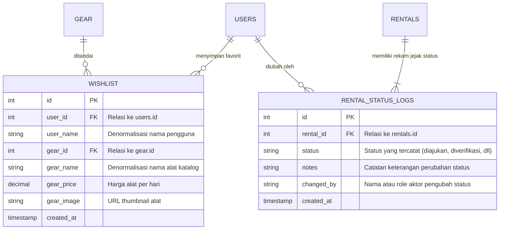

# 📋 Laporan Teknis & Spesifikasi Modul: Wishlist & Status History Logs
**Project:** NEXORA (HikeRent) • **Backend Gateway:** HMIF UNRAM API Gateway v2 • **Versi:** 1.0 (September 2026)  
**Dokumentasi Acuan:** Rencana Integrasi Sistem NEXORA, Gambar Spesifikasi Modul Wishlist & Status History Logs

---

## 1. Ringkasan Modul & Struktur Gambar Acuan

Modul **Wishlist (`/hikerent/wishlist`)** dan **Status History Logs (`/hikerent/rental_status_logs`)** adalah komponen penting dalam alur pengalaman pengguna dan akuntabilitas operasional sistem rental alat pendakian NEXORA:
1. **Wishlist**: Memungkinkan peminjam menandai dan menyimpan peralatan pendakian favorit yang diminati sebelum menyewa, serta memudahkan peninjauan stok alat impian sebelum pendakian.
2. **Status History Logs**: Mencatat linimasa dan rekam jejak audit (*audit trail*) setiap transisi status penyewaan (dari `diajukan`, `diverifikasi`, `diambil`, hingga `dikembalikan`), memastikan transparansi antara peminjam dan pihak admin rental.

### Visualisasi Struktur Endpoint (Sesuai Gambar Acuan)

```
┌────────────────────────────────────────────────────────────────────────────────────────┐
│ ≡ Wishlist   [ /hikerent/wishlist ]                                                    │
├────────┬───────────────────────────────────┬───────────────────────────────────────────┤
│ [GET]  │ /hikerent/wishlist                │ Mengambil daftar seluruh wishlist         │
├────────┼───────────────────────────────────┼───────────────────────────────────────────┤
│ [GET]  │ /hikerent/wishlist/{id}           │ Mengambil detail single wishlist          │
│        │                                   │ berdasarkan ID                            │
├────────┼───────────────────────────────────┼───────────────────────────────────────────┤
│ [POST] │ /hikerent/wishlist                │ Membuat data baru wishlist                │
├────────┼───────────────────────────────────┼───────────────────────────────────────────┤
│ [PUT]  │ /hikerent/wishlist/{id}           │ Memperbarui data wishlist berdasarkan ID  │
├────────┼───────────────────────────────────┼───────────────────────────────────────────┤
│ [DEL]  │ /hikerent/wishlist/{id}           │ Menghapus data wishlist berdasarkan ID    │
└────────┴───────────────────────────────────┴───────────────────────────────────────────┘

┌────────────────────────────────────────────────────────────────────────────────────────┐
│ ≡ Status History Logs   [ /hikerent/rental_status_logs ]                               │
├────────┬───────────────────────────────────┬───────────────────────────────────────────┤
│ [GET]  │ /hikerent/rental_status_logs      │ Mengambil daftar seluruh status history   │
│        │                                   │ logs                                      │
├────────┼───────────────────────────────────┼───────────────────────────────────────────┤
│ [GET]  │ /hikerent/rental_status_logs/{id} │ Mengambil detail single status history    │
│        │                                   │ logs berdasarkan ID                       │
├────────┼───────────────────────────────────┼───────────────────────────────────────────┤
│ [POST] │ /hikerent/rental_status_logs      │ Membuat data baru status history logs     │
├────────┼───────────────────────────────────┼───────────────────────────────────────────┤
│ [PUT]  │ /hikerent/rental_status_logs/{id} │ Memperbarui data status history logs      │
│        │                                   │ berdasarkan ID                            │
├────────┼───────────────────────────────────┼───────────────────────────────────────────┤
│ [DEL]  │ /hikerent/rental_status_logs/{id} │ Menghapus data status history logs        │
│        │                                   │ berdasarkan ID                            │
└────────┴───────────────────────────────────┴───────────────────────────────────────────┘
```

---

## 2. Arsitektur Relasi Basis Data (3NF)

Kedua modul dirancang terintegrasi dengan tabel `users`, `gear`, dan `rentals` yang telah dibangun sebelumnya:



---

## 3. Spesifikasi Rinci: Modul Wishlist (`/hikerent/wishlist`)

### 3.1. `GET /hikerent/wishlist`
Mengambil daftar seluruh item wishlist yang tersimpan.

- **URL:** `https://hmif.if.unram.ac.id/api/v2/hikerent/wishlist`
- **Method:** `GET`
- **Headers:**
  - `X-API-Key: pk_hikerent_da4b2b680ab481f4`
  - `Authorization: Bearer <token>`
- **Response Sukses (HTTP 200 OK - Data Aktual Backend):**
  ```json
  [
    {
      "id": 1,
      "user_id": 13,
      "user_name": "Peminjam Demo",
      "gear_id": 1,
      "gear_name": "Tenda Dome Borneo 4 Person Double Layer",
      "gear_price": "45000.00",
      "created_at": "2026-09-18 19:07:29"
    }
  ]
  ```

---

### 3.2. `GET /hikerent/wishlist/{id}`
Mengambil detail single item wishlist berdasarkan ID unik.

- **URL:** `https://hmif.if.unram.ac.id/api/v2/hikerent/wishlist/{id}` *(Contoh: `/hikerent/wishlist/1`)*
- **Method:** `GET`
- **Headers:** `X-API-Key: pk_hikerent_...`
- **Response Sukses (HTTP 200 OK - Data Aktual Backend):**
  ```json
  {
    "id": 1,
    "user_id": 13,
    "user_name": "Peminjam Demo",
    "gear_id": 1,
    "gear_name": "Tenda Dome Borneo 4 Person Double Layer",
    "gear_price": "45000.00",
    "gear_image": null,
    "created_at": "2026-09-18 19:07:29"
  }
  ```

---

### 3.3. `POST /hikerent/wishlist`
Peminjam menandai alat katalog ke dalam daftar wishlist.

- **URL:** `https://hmif.if.unram.ac.id/api/v2/hikerent/wishlist`
- **Method:** `POST`
- **Headers:**
  - `Content-Type: application/json`
  - `X-API-Key: pk_hikerent_da4b2b680ab481f4`
  - `Authorization: Bearer <token>`
- **Field yang Wajib:**
  - `user_id` *(Wajib, Integer)*: ID pengguna peminjam yang sedang login.
  - `gear_id` *(Wajib, Integer)*: ID alat dari katalog `gear`.
- **Request Body Payload:**
  ```json
  {
    "user_id": 13,
    "gear_id": 1
  }
  ```
- **Response Sukses (HTTP 201 Created - Data Aktual Backend):**
  ```json
  {
    "id": 1,
    "user_id": 13,
    "gear_id": 1,
    "created_at": "2026-09-18 19:07:29"
  }
  ```
- **Validasi Gagal (HTTP 400 Bad Request):**
  ```json
  {
    "error": "Bad Request",
    "message": "user_id/gear_id tidak valid."
  }
  ```

---

### 3.4. `PUT /hikerent/wishlist/{id}`
Memperbarui informasi item wishlist.

- **URL:** `https://hmif.if.unram.ac.id/api/v2/hikerent/wishlist/{id}`
- **Method:** `PUT`
- **Request Body Payload:**
  ```json
  {
    "gear_id": 2
  }
  ```
- **Response Sukses (HTTP 200 OK):** `{ "success": true, "message": "Wishlist berhasil diperbarui." }`

---

### 3.5. `DELETE /hikerent/wishlist/{id}`
Menghapus item dari daftar wishlist peminjam.

- **URL:** `https://hmif.if.unram.ac.id/api/v2/hikerent/wishlist/{id}`
- **Method:** `DELETE`
- **Response Sukses (HTTP 200 OK):** `{ "success": true, "message": "Item berhasil dihapus dari wishlist." }`

---

## 4. Spesifikasi Rinci: Modul Status History Logs (`/hikerent/rental_status_logs`)

### 4.1. `GET /hikerent/rental_status_logs`
Mengambil daftar seluruh status history logs yang tercatat di sistem.

- **URL:** `https://hmif.if.unram.ac.id/api/v2/hikerent/rental_status_logs`
- **Method:** `GET`
- **Headers:** `X-API-Key: pk_hikerent_...`
- **Response Sukses (HTTP 200 OK):**
  ```json
  [
    {
      "id": 1,
      "rental_id": 10,
      "status": "diverifikasi",
      "notes": "Pengajuan diverifikasi oleh Admin setelah pemeriksaan KTP.",
      "changed_by": "admin@nexora.id",
      "created_at": "2026-09-18 19:15:00"
    }
  ]
  ```

---

### 4.2. `GET /hikerent/rental_status_logs/{id}`
Mengambil satu rekaman status log berdasarkan ID unik.

- **URL:** `https://hmif.if.unram.ac.id/api/v2/hikerent/rental_status_logs/{id}`
- **Method:** `GET`
- **Response Sukses (HTTP 200 OK):** Objek tunggal detail log status sewa.

---

### 4.3. `POST /hikerent/rental_status_logs`
Mencatat entri baru ke dalam riwayat status sewa (audit trail).

- **URL:** `https://hmif.if.unram.ac.id/api/v2/hikerent/rental_status_logs`
- **Method:** `POST`
- **Headers:**
  - `Content-Type: application/json`
  - `X-API-Key: pk_hikerent_da4b2b680ab481f4`
  - `Authorization: Bearer <token>`
- **Field yang Wajib & Format:**
  - `rental_id` *(Wajib, Integer)*: ID transaksi sewa dari tabel `rentals`.
  - `status` *(Wajib, String)*: Status baru (`diajukan`, `diverifikasi`, `diambil`, `dikembalikan`, `dibatalkan`).
  - `notes` *(Opsional, String)*: Catatan petugas/alasan perubahan status.
  - `changed_by` *(Opsional, String)*: Nama atau identitas admin/sistem yang melakukan perubahan.
- **Request Body Payload:**
  ```json
  {
    "rental_id": 10,
    "status": "diverifikasi",
    "notes": "Peminjaman disetujui. Siap diambil di basecamp.",
    "changed_by": "admin@nexora.id"
  }
  ```
- **Response Sukses (HTTP 201 Created):**
  ```json
  {
    "id": 1,
    "rental_id": 10,
    "status": "diverifikasi",
    "notes": "Peminjaman disetujui. Siap diambil di basecamp.",
    "changed_by": "admin@nexora.id",
    "created_at": "2026-09-18 19:15:00"
  }
  ```
- **Validasi Gagal (HTTP 400 Bad Request):**
  ```json
  {
    "error": "Bad Request",
    "message": "Field \"rental_id\" wajib diisi."
  }
  ```

---

### 4.4. `PUT /hikerent/rental_status_logs/{id}`
Memperbarui catatan pada rekam jejak status sewa.

- **URL:** `https://hmif.if.unram.ac.id/api/v2/hikerent/rental_status_logs/{id}`
- **Method:** `PUT`
- **Request Body Payload:**
  ```json
  {
    "notes": "Koreksi catatan verifikasi KTP."
  }
  ```
- **Response Sukses (HTTP 200 OK):** `{ "success": true, "message": "Log status berhasil diperbarui." }`

---

### 4.5. `DELETE /hikerent/rental_status_logs/{id}`
Menghapus rekaman log audit status sewa tertentu.

- **URL:** `https://hmif.if.unram.ac.id/api/v2/hikerent/rental_status_logs/{id}`
- **Method:** `DELETE`
- **Response Sukses (HTTP 200 OK):** `{ "success": true, "message": "Log status berhasil dihapus." }`

---

## 5. Matriks Pemetaan ke Frontend NEXORA (Soft Landing & Zero UI/UX Regression)

| Fitur / Halaman | Berkas Komponen | Endpoint Terkait | Mekanisme & Dampak UI/UX |
| :--- | :--- | :--- | :--- |
| **Bookmark Favorit Katalog** | `app/components/shared/CatalogView.js` | `POST /wishlist`<br>`DELETE /wishlist/{id}` | Tombol hati/bookmark halus (`♡` / `♥`) pada tiap kartu alat. Klik menyimpan atau menghapus item dari wishlist tanpa merombak grid tampilan. |
| **Filter Wishlist Peminjam** | `app/components/shared/CatalogView.js` | `GET /wishlist` | Menambahkan tombol filter *"Wishlist"* untuk melihat alat yang disimpan pengguna. |
| **Linimasa Audit Status** | `app/user/riwayat/page.js` | `GET /rental_status_logs` | Peminjam dapat melihat riwayat waktu status diverifikasi, diambil, dan dikembalikan pada kartu pesanan. |
| **Pencatatan Audit Admin** | `app/admin/approval/page.js` | `POST /rental_status_logs` | Saat admin menekan tombol *Verifikasi* atau update status, sistem otomatis mencatat log audit ke backend. |
| **Riwayat Transaksi Admin** | `app/admin/history/page.js` | `GET /rental_status_logs` | Admin dapat meninjau log perubahan status untuk keperluan laporan operasional. |
| **Pusat Pengujian API** | `app/api-test/page.js` | Semua 10 Endpoint | Menampilkan dua kartu visual neo-modern persis sesuai gambar acuan dengan tombol uji langsung. |
